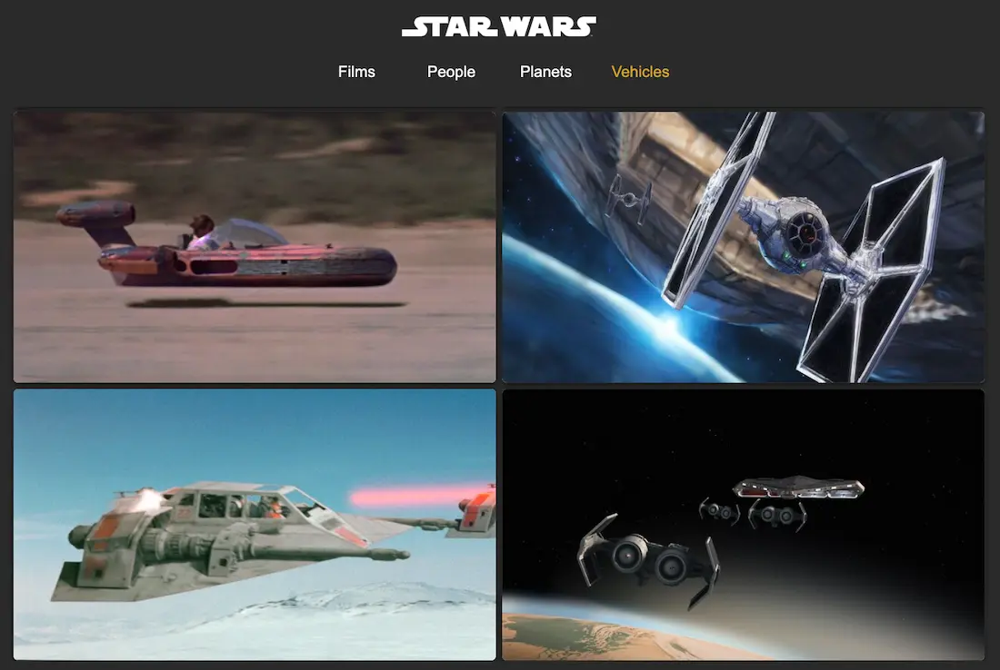

# Star Wars API Explorer



## Overview

A responsive web application that explores the Star Wars universe using the Star Wars API (SWAPI). Users can browse films, characters, planets, and vehicles with interactive cards and detailed information displays.

## GitHub Repository

[GitHub Repository](https://github.com/jerzyszajner/star-wars-api-explorer.git)

## Deployment

**Visit the live project here:** [Live Project on Netlify](https://star-wars-api-explorer.netlify.app/)

## Features

- Browse Star Wars films, people, planets, and vehicles
- Interactive card system with hover effects and click-to-reveal details
- Responsive navigation with mobile hamburger menu
- Error notifications for connection issues
- Offline detection and user feedback
- Smooth animations and transitions
- Local image gallery for enhanced visual experience

## Installation

### Prerequisites

- [Node.js](https://nodejs.org/) & npm

### Steps

1. Clone the repository:

   ```sh
   git clone https://github.com/jerzyszajner/star-wars-api-explorer.git
   cd star-wars-api-explorer
   ```

2. Install dependencies:

   ```sh
   npm install
   ```

3. Run the development server:

   ```sh
   npm run dev
   ```

4. Build for production:
   ```sh
   npm run build
   ```

## Usage

1. **Navigate Categories**: Use the navigation buttons to switch between Films, People, Planets, and Vehicles
2. **View Details**: Click on any card to reveal detailed information with sliding animation
3. **Mobile Experience**: On mobile devices, use the hamburger menu for navigation
4. **Error Handling**: The app will notify you of connection issues or API failures

## Technologies

- **HTML, CSS, JavaScript**: Semantics, modular CSS (BEM), interactive JavaScript
- **Responsive Design**: Mobile-friendly, tested on iPhone 13 Pro Max
- **Vite**: Fast dev server and optimized builds
- **Font Awesome**: UI icons
- **SWAPI**: Fetching Star Wars data

## Brief Description

This application demonstrates modern web development practices including:

- Modular ES6 JavaScript with import/export
- Async/await for API communication
- CSS Grid and Flexbox for responsive layouts
- CSS custom properties for consistent theming
- Error handling and user feedback systems

## Challenges

- Implementing card animations and transitions
- Matching local images with API data

## Testing

- **Browsers:** Google Chrome and Safari.
- **Devices:** iPhone 13 Pro Max.
- **Methods:** Manual testing and debugging using browser developer tools and AI.

## Credits

- **Inspiration**: https://www.starwars.com/
- **API**: [The Star Wars API (SWAPI)](https://swapi.py4e.com/)
- **Graphics**: Images and icons from: [Star Wars Official](https://www.starwars.com/)

## License

- MIT © Jerzy Szajner: [License.txt](License.txt)

## Contact Information

- [jerzy.szajner@gmail.com](mailto:jerzy.szajner@gmail.com)
- [LinkedIn](https://www.linkedin.com/in/jerzyszajner/)
